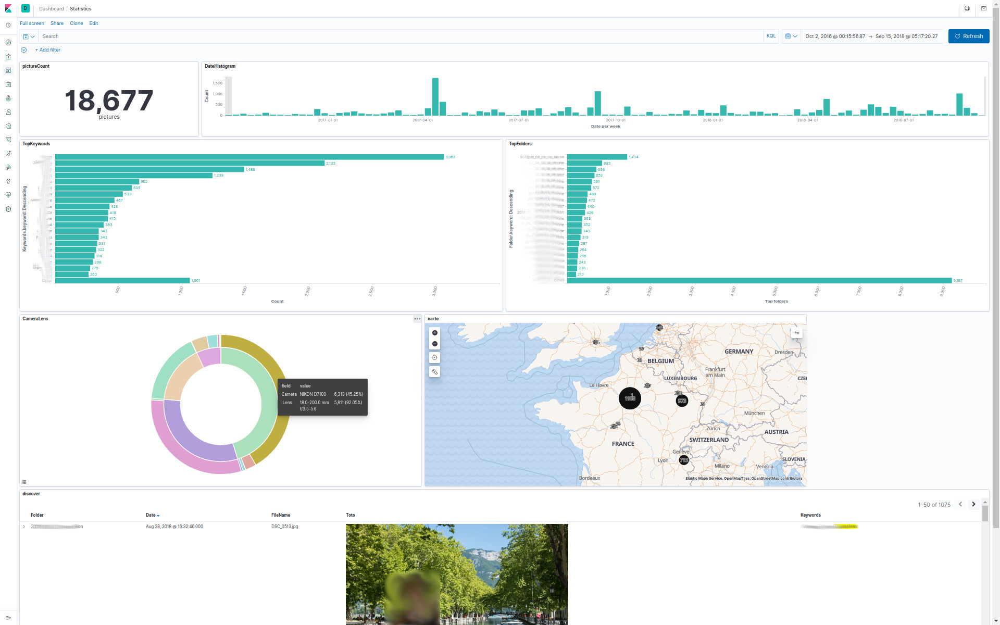

# picdexer

[](https://travis-ci.org/barasher/picdexer)
[](https://codecov.io/gh/barasher/picdexer)

**`picdexer`** is a picture indexing solution :
- it extracts metadata from pictures
- metadata are indexed on [`elasticsearch`](https://www.elastic.co/elasticsearch/)
- pictures can be downsampled and stored using [`file-server`](https://github.com/barasher/file-server)
- it provides a view over indexed data using [`kibana`](https://www.elastic.co/kibana/)

**`picdexer`** orchestrates the whole process :
- it configures [`elasticsearch`](https://www.elastic.co/elasticsearch/)
- it configures [`kibana`](https://www.elastic.co/kibana/)
- it extracts and index pictures metadata
- it can store pictures (possibly resized)

## Screenshots



- [Statistics dashboard](screenshots/statistics.jpg)
- [Browse dashboard](screenshots/browse.jpg)
- [Discover panel](screenshots/discover.jpg)

## Getting pixdexer

**`picdexer`** is released :
- As a compiled binary on the [Github project release section](https://github.com/barasher/picdexer/releases). If you have a [golang environment](https://golang.org/doc/install), you can compile the projet : `go build -o file-server picdexer.go`
- As a docker imaged on [Docker Hub](https://hub.docker.com/r/barasher/picdexer/tags). If you have a [docker environment], you can build the image : `docker build .` 

## How to configure

In the **`picdexer`** docker image :
- the configuration file is located in `/etc/picdexer/picdexer.json`
- the "input" folder is located in `/data/picdexer/in/`
- the "output" folder (for simulations) is located in `/data/picdexer/out/`
- the default "dropzone" folder is `/data/picdexer/dropzone/`

The configuration file is a JSON file, here is a complexe example :

```json
{
  "loggingLevel": "warn",
  "elasticsearch": {
    "url": "http://192.168.1.102:9200",
    "extractionThreadCount": 4,
    "toExtractChannelSize": 50
  },
  "binary": {
    "url": "http://192.168.1.100:8080",
    "height":480,
    "width":640,
    "resizingThreadCount": 4,
    "toResizeChannelSize": 4 
  },
  "kibana": {
    "url": "http://192.168.1.102:5601"
  },
  "dropzone": {
    "root": "/tmp/foo",
    "period": "5s",
    "fileChannelSize": 10
  }
}
```
- `loggingLevel` (optional) defines the logging level. Values :`debug`, `info` (default), `warn`, `error`, ...
- `elasticsearch` (required if used) configures the `elasticsearch` connexion and the metadata extraction process
  - `url` (required if documents are pushed) defines the `elasticsearch` endpoint
  - `extractionThreadCount` (optional, default : `4`) defines how many thread have to be used to extract medatada 
  - `toExtractChannelSize` (optimal, default : `50`) defines the size of the file buffer (go channel) that will be consumed by the extraction goroutines
- `binary` (required if used) configures the interactions with `file-server` to store pictures
  - `url` (required if pictures are pushed) defines the `file-server` endpoint
  - `height` and `width` defines the target dimension of the pictures that will be stored. If one of the dimension is `0` then pictures will not be resized (default behaviour).
  - `resizingThreadCount`   (optional, default : `4`) defines how many thread have to be used to resize pictures
  - `toResizeChannelSize` (optional, default : `4`) defines the size of the file buffer (go channel) that will be consumed by the resizing goroutines
- `kibana` (required if user) configures the interaction with `kibana` (for configuration purpose)
  - `url` (required if kibana has to be configured) defines the `kibana` endpoint
- `dropzone` (required if used) configures dropzone
  - `root` (required) defines the watched folder
  - `period` defines where waiting period between to watching iteration ([syntax](https://golang.org/pkg/time/#ParseDuration), ex : 1m, 1h, 30s, ...)
  - `fileChannelSize` (optional, default : `10`) defines the size of the buffer (go channel) that will be consumed by indexation

## Picdexer commands

**`picdexer`** have several commands that can be used. Each command is dedicated to specific purpose.

If the return code is `0`, the command is successfully execute. If any problem happens, the return code will be > `0`.

### Setup

**`picdexer`** can setup :
- `elasticsearch` mapping ([mapping.json](internal/setup/assets/mapping.json))
- `kibana` index-pattern, visualizations, dashboards ([kibana.ndjson](internal/setup/assets/kibana.ndjson))

**:warning: : the maximum table cell height has to be set tu `0` in `kibana`.** Since there is no official global setting `kibana` REST API, it has to be setup manually. In the `kibana` interface, go to `Management` > `Advanced settings` > `General` > `Maximum table cell height` and set the value to `0`.

The `elasticsearch` and `kibana` part of the configuration file has to be filled.

- Command line version : `./pcidexer setup -c [configurationFile]`
- Docker version :

```shell script
docker run --rm
  -v [hostConfigurationFile]:/etc/picdexer/picdexer.json
  barasher/picdexer:1.0.0 ./setup.sh
```

### Full process

The full process command extracts metadata, resize (eventually) and store pictures.

- Command line version : `./picdexer full -c [configurationFile] -d [sourceFolder]`
- Docker version :

```shell script
docker run --rm
  -v [hostSourceFolder]:/data/picdexer/in
  -v [hostConfigurationFile]:/etc/picdexer/picdexer.json
  barasher/picdexer:1.0.0 ./full.sh
```

### Metadata management

The metadata command deals with `elasticsearch` metadata indexation.

#### Metadata extraction simulation

This command simulates the indexation (dump the `elasticsearch` documents on stdout).

- Command line version : `./picdexer metadata simulate -c [configurationFile] -d [sourceFolder]`
- Docker version :

```shell script
docker run --rm
  -v [hostSourceFolder]:/data/picdexer/in
  -v [hostConfigurationFile]:/etc/picdexer/picdexer.json
  barasher/picdexer:1.0.0 ./metadata_simulate.sh
```

#### Metadata indexation

This command indexes metadata to `elasticsearch`.

- Command line version : `./picdexer metadata index -c [configurationFile] -d [sourceFolder]`
- Docker version :

```shell script
docker run --rm
  -v [hostSourceFolder]:/data/picdexer/in
  -v [hostConfigurationFile]:/etc/picdexer/picdexer.json
  barasher/picdexer:1.0.0 ./metadata_index.sh
```

#### Listing all metadata from a file

This command extracts all the metadata available for a picture : `./picdexer metadata display -f [pictureFile]`

### Pictures (binary) management

The binary command deals with the picture storage in `file-server`.

#### Picture resizing simulation

This command simulates the resizing and stores resized file in the filesystem.

- Command line version : `./picdexer binary simulate -c [configurationFile] -d [sourceFolder] -o [outputFolder]`.
- Docker version :

```shell script
docker run --rm
  -v [hostSourceFolder]:/data/picdexer/in
  -v [hostTargetFolder]:/data/picdexer/out
  -v [hostConfigurationFile]:/etc/picdexer/picdexer.json
  barasher/picdexer:1.0.0 ./binary_simulate.sh
```

#### Picture pushing

This command resizes pictures and stores the resized version in `file-server`.

- Command line version : `./picdexer binary push -c [configurationFile] -d [sourceFolder]`.
- Docker version :

```shell script
docker run --rm
  -v [hostSourceFolder]:/data/picdexer/in
  -v [hostConfigurationFile]:/etc/picdexer/picdexer.json
  barasher/picdexer:1.0.0 ./binary_push.sh
```

### Dropzone (watch a folder)

This command watches a folder, index, stores pictures and delete files.

- Command line version : `./picdexer dropzone -c [configurationFile]`
- Docker version :

```shell script
docker run --rm
  -v [hostSourceFolder]:/data/picdexer/in
  -v [hostConfigurationFile]:/etc/picdexer/picdexer.json
  barasher/picdexer:1.0.0 filewatcher
```